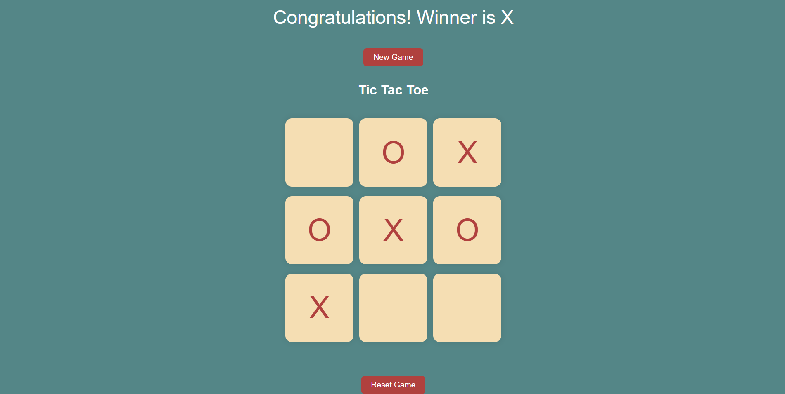
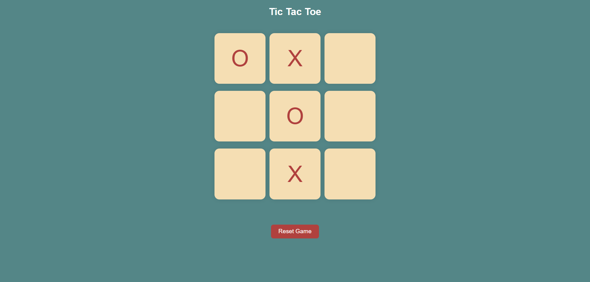
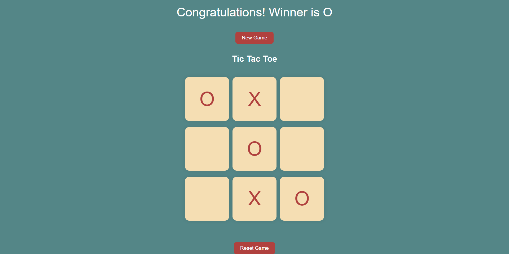
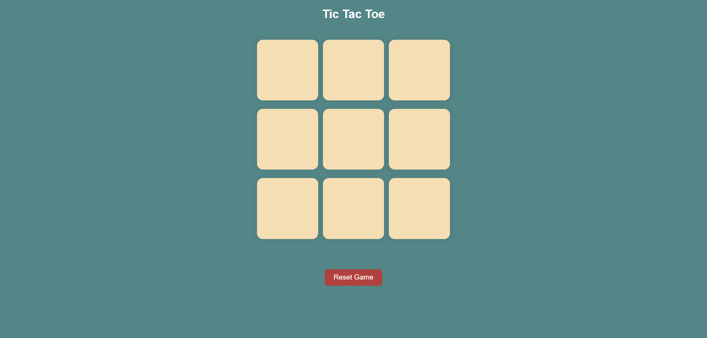

# Tic Tac Toe Game

A simple and interactive Tic Tac Toe game built using HTML, CSS, and JavaScript.

## Features

- Two player game (X and O)
- Winner detection system
- Reset Game button
- New Game button
- Responsive UI
- Clean design

## Technologies Used

- HTML5
- CSS3
- JavaScript

## Screenshot

## How to Run

1. Download or clone the repository
2. Open `index.html` in your browser

## GitHub Repository

Created by Shahid Chowdhury

GitHub: https://github.com/shahidchowdhurydev
